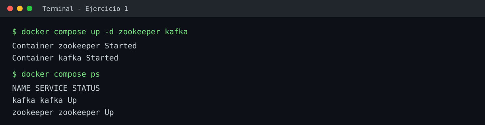
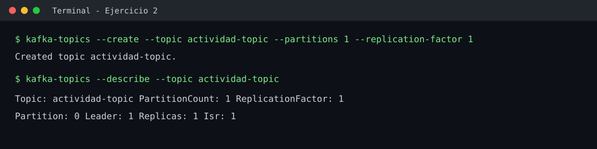
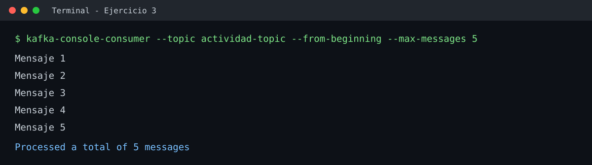
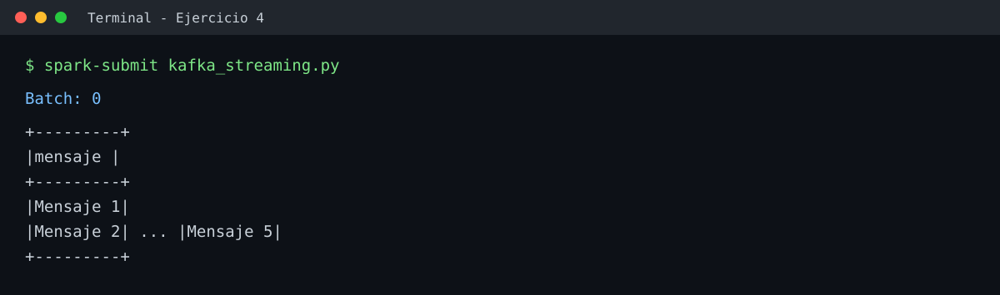
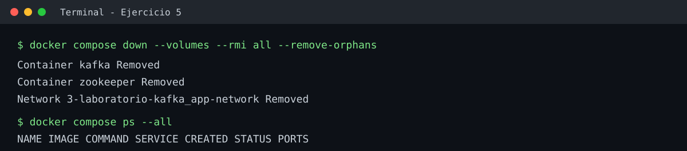

# Procesamiento en Tiempo Real con Spark y Kafka

**Autor:** Giancarlo Clavijo Llerena

## Parte 1: Conceptos básicos

### Docker

#### 1. ¿Qué es un contenedor y cómo se diferencia de una máquina virtual?

Un contenedor es un entorno aislado que ejecuta una aplicación junto con sus dependencias, compartiendo el sistema operativo del host. Una máquina virtual incluye su propio sistema operativo completo, por lo que consume más recursos.

#### 2. ¿Qué son los volúmenes en Docker y para qué sirven?

Los volúmenes permiten almacenar datos de forma persistente fuera del ciclo de vida del contenedor. Así, los datos no se pierden cuando el contenedor se elimina o se vuelve a crear.

#### 3. ¿Cuál es la diferencia entre `docker run` y `docker compose`?

`docker run` se utiliza principalmente para crear y ejecutar un contenedor individual. `docker compose` permite definir y levantar varios servicios relacionados mediante un archivo `compose.yaml`.

### Kafka

#### 4. ¿Qué es un topic en Kafka?

Un topic es una categoría o canal donde Kafka almacena los mensajes o eventos enviados por los productores para que luego sean consumidos por uno o varios consumidores.

#### 5. ¿Cuál es la función de ZooKeeper dentro de un clúster Kafka?

ZooKeeper se utilizaba para coordinar los brokers de Kafka, gestionar metadatos y participar en la elección de líderes. En versiones modernas de Kafka esta función puede realizarse mediante KRaft, eliminando la dependencia de ZooKeeper.

#### 6. ¿Qué significan las particiones y el replication factor en un topic?

Las particiones dividen un topic en varias partes, permitiendo distribuir y procesar los mensajes en paralelo. El replication factor indica cuántas copias de cada partición existen en diferentes brokers para proporcionar tolerancia a fallos.

### Spark

#### 7. ¿Qué es Spark y cuál es su propósito?

Apache Spark es un motor de procesamiento distribuido utilizado para procesar grandes volúmenes de datos de forma rápida utilizando varios nodos de un clúster.

#### 8. ¿Cuál es la diferencia entre RDD, DataFrame y Dataset?

Un RDD es una colección distribuida de datos de bajo nivel y ofrece mayor control. Un DataFrame organiza los datos en filas y columnas y permite optimizaciones automáticas. Un Dataset combina características de RDD y DataFrame, ofreciendo estructura y tipado; se utiliza principalmente con Scala y Java.

#### 9. ¿Qué es Spark Streaming y para qué se utiliza?

Spark Streaming permite procesar datos que llegan continuamente, como eventos de Kafka, logs o información de sensores. Se utiliza para realizar procesamiento y análisis de datos prácticamente en tiempo real.

## Parte 2: Actividad práctica

### Ejercicio 1: Levantar los servicios

Se definieron los servicios `zookeeper` y `kafka` en `docker-compose.yml`, usando las imágenes `confluentinc/cp-zookeeper:7.5.0` y `confluentinc/cp-kafka:7.5.0`.

```bash
docker compose down --volumes --remove-orphans
docker compose up -d zookeeper kafka
docker compose ps
```

Kafka quedó expuesto en los puertos `9092` y `29092`, y ZooKeeper en el puerto `2181`.



### Ejercicio 2: Crear un topic

```bash
docker compose exec -T kafka kafka-topics --bootstrap-server kafka:9092 \
  --create --topic actividad-topic --partitions 1 --replication-factor 1

docker compose exec -T kafka kafka-topics --bootstrap-server kafka:9092 \
  --describe --topic actividad-topic
```



### Ejercicio 3: Enviar y leer mensajes

Se enviaron cinco mensajes al topic mediante `kafka-console-producer` y se leyeron desde el inicio con `kafka-console-consumer`.

```bash
docker compose exec -T kafka kafka-console-producer \
  --bootstrap-server kafka:9092 --topic actividad-topic < spark-app/mensajes.txt

docker compose exec -T kafka kafka-console-consumer \
  --bootstrap-server kafka:9092 --topic actividad-topic \
  --from-beginning --max-messages 5
```



### Ejercicio 4: Spark Streaming básico

Se implementó el script `spark-app/kafka_streaming.py`. Este se conecta a `kafka:9092`, lee `actividad-topic` desde el inicio y escribe los mensajes en la consola durante 30 segundos.

```bash
docker compose up -d spark-master spark-worker jupyter
docker compose exec -T jupyter spark-submit --master 'local[2]' \
  --packages org.apache.spark:spark-sql-kafka-0-10_2.12:3.4.0 \
  /home/layla/work/kafka_streaming.py
```

Se usó el conector `3.4.0` porque esa es la versión de Spark instalada en la imagen de Jupyter.



### Ejercicio 5: Limpieza de recursos

Al finalizar la práctica se ejecutó el siguiente comando para eliminar los contenedores, las redes, los volúmenes y las imágenes del laboratorio:

```bash
docker compose down --volumes --rmi all --remove-orphans
```



## Parte 3: Comunicación de aprendizajes

El artículo académico sobre la experiencia desarrollada durante la práctica fue publicado en Medium. En él se describen los aprendizajes sobre Docker, Kafka y Spark, los desafíos técnicos enfrentados y la importancia del procesamiento de datos en tiempo real.

**Artículo en Medium:** [Mi primera práctica de procesamiento en tiempo real con Docker, Kafka y Spark](https://medium.com/@giancarloclavijollerena/mi-primera-pr%C3%A1ctica-de-procesamiento-en-tiempo-real-con-docker-kafka-y-spark-73f19c965a9d)
